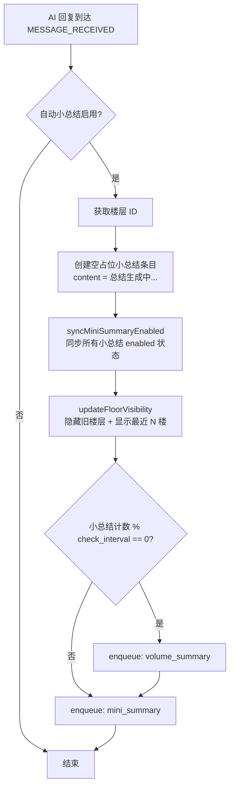
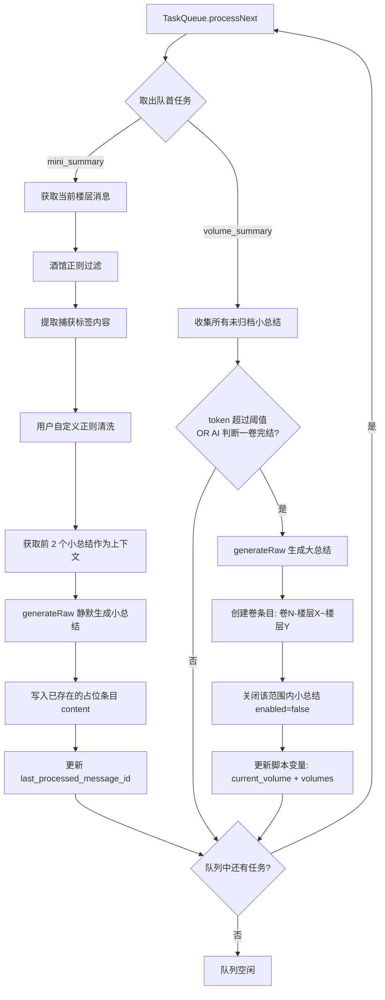
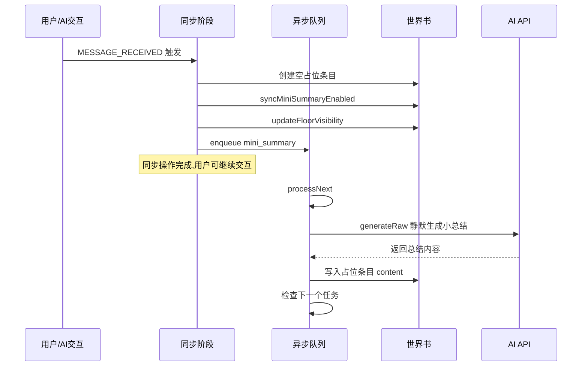
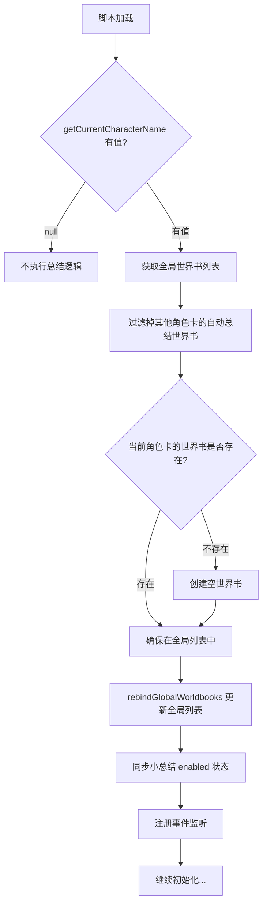

# Hilo's Automatic Summary - 自动总结脚本架构设计

## 一、概述

本脚本是一个酒馆助手脚本，自动/手动将聊天记录发送给 AI 进行总结，并将总结结果存入全局世界书。支持：

- 每次 AI 回复后自动异步静默生成**小总结**（使用当前楼层 + 前 2 个楼层的小总结作为上下文）
- 每 20 个小总结触发一次检查，判断是否满足**大总结（卷总结）**条件
- 大总结阈值：token 数超限 或 AI 识别一卷已完结
- 自动管理楼层可见性（最近 N 楼显示，已总结的旧楼层隐藏）
- 支持自定义 API 配置（URL、密钥、模型）用于总结请求
- 支持酒馆正则过滤消息内容
- 支持内容捕获标签（仅总结指定标签之间的内容）
- 支持自定义正则清洗消息内容
- 提供 UI 设置页面（通过酒馆扩展菜单入口打开）
- 脚本加载时自动切换到当前角色卡的世界书，卸载其他角色卡的总结世界书
- **任务队列**：所有总结任务排入队列依次处理，避免并发冲突
- **重复检测**：若当前楼层已有小总结则替换而非跳过

## 二、数据架构

### 2.1 世界书结构

使用与角色卡绑定的全局世界书存放总结数据。世界书名称为 `${getCurrentCharacterName()}[自动总结]`，例如角色卡名为「白娅」时世界书名称为 `白娅[自动总结]`。

> [`getCurrentCharacterName()`](@types/function/character.d.ts:33) 返回当前角色卡名称，若未打开角色卡则返回 `null`（此时脚本不执行总结逻辑）。

**世界书自动管理**：脚本加载时，通过 [`getGlobalWorldbookNames()`](@types/function/worldbook.d.ts:13) 获取所有全局世界书，将其中其他角色卡的 `xxx[自动总结]` 世界书从全局列表中移除（使用 [`rebindGlobalWorldbooks()`](@types/function/worldbook.d.ts:19)），并确保当前角色卡的总结世界书在全局列表中。

### 2.2 条目结构

小总结和卷总结

```
条目名称格式               | 用途                              | enabled  | order
--------------------------|----------------------------------|---------|------
[小总结-楼层1]             | 第 1 楼的小总结                   | 取决于可见性 | 10001
[小总结-楼层2]             | 第 2 楼的小总结                   | 取决于可见性 | 10002
...                       |                                  |         |
[小总结-楼层5]             | 第 5 楼的小总结                   | 取决于可见性 | 10005
[小总结-楼层6]             | 第 6 楼的小总结                   | 取决于可见性 | 10006
...                       |                                  |         |
[卷1-楼层1~楼层30]         | 第 1 卷大总结, 覆盖楼层 1-30      | true    | 101
[卷2-楼层31~楼层58]        | 第 2 卷大总结, 覆盖楼层 31-58     | true    | 102
...                       |                                  |         |
```

#### 小总结条目 enabled 规则

小总结条目的 `enabled` 状态取决于对应楼层的可见性：

- **最近 N 楼（可见楼层）**：对应的小总结 `enabled: false`（这些楼层的原始消息已经在聊天历史中，无需重复注入总结）
- **更早的已隐藏楼层**：对应的小总结 `enabled: true`（这些楼层被隐藏了，需要通过总结让 AI 感知）
- **已被大总结归档的楼层**：对应的小总结 `enabled: false`（已有卷总结覆盖）

#### 卷条目

`[卷N-楼层X~楼层Y]` — 大总结条目，始终 `enabled: true`，注入 AI 提示词。条目名称包含卷号和楼层范围，便于追溯。

### 2.3 元数据存储

元数据存放在**脚本变量**（`{type: 'script'}`）中：

```typescript
/** 脚本变量中存储的运行时元数据 */
type ScriptMetadata = {
  /** 当前卷号 - 下一个大总结将是第几卷 */
  current_volume: number;
  /** 上次处理到的楼层 ID */
  last_processed_message_id: number;
  /** 已归档的卷信息 */
  volumes: VolumeInfo[];
};

type VolumeInfo = {
  /** 卷号 */
  volume: number;
  /** 起始楼层 ID */
  start_message_id: number;
  /** 结束楼层 ID */
  end_message_id: number;
};
```

> 脚本变量中同时存储用户设置（Settings）和运行时元数据（ScriptMetadata），两者合并在一个脚本变量对象中。

### 2.4 条目配置

小总结条目默认配置：

```typescript
/** 小总结 order 基数，实际 order = MINI_SUMMARY_ORDER_BASE + message_id */
const MINI_SUMMARY_ORDER_BASE = 10000;

/** 根据楼层 ID 计算小总结条目的 order 值 */
function getMiniSummaryOrder(message_id: number): number {
  return MINI_SUMMARY_ORDER_BASE + message_id;
}

const MINI_SUMMARY_DEFAULTS: Partial<WorldbookEntry> = {
  enabled: false, // 默认不启用，由可见性管理逻辑决定是否启用
  strategy: { type: 'constant', keys: [], keys_secondary: { logic: 'and_any', keys: [] }, scan_depth: 'same_as_global' },
  // order 由 getMiniSummaryOrder(message_id) 动态计算，例如楼层1→10001, 楼层2→10002, ...
  position: { type: 'at_depth', role: 'system', depth: 9999, order: 10000 },
  probability: 100,
  recursion: { prevent_incoming: true, prevent_outgoing: true, delay_until: null },
  effect: { sticky: null, cooldown: null, delay: null },
};
```

卷条目默认配置（order 基数更小以在小总结之前注入，同样按卷号递增）：

```typescript
/** 卷总结 order 基数，实际 order = VOLUME_ORDER_BASE + volume */
const VOLUME_ORDER_BASE = 100;

/** 根据卷号计算卷条目的 order 值 */
function getVolumeOrder(volume: number): number {
  return VOLUME_ORDER_BASE + volume;
}

const VOLUME_DEFAULTS: Partial<WorldbookEntry> = {
  ...MINI_SUMMARY_DEFAULTS,
  enabled: true, // 卷总结始终启用
  // order 由 getVolumeOrder(volume) 动态计算，例如卷1→101, 卷2→102, ...
  position: { type: 'at_depth', role: 'system', depth: 9999, order: 100 },
};
```

> **order 递增规则说明**：
> - 小总结：`order = 10000 + message_id`，如 `[小总结-楼层1]` order=10001, `[小总结-楼层2]` order=10002, ...
> - 卷总结：`order = 100 + volume`，如 `[卷1-楼层1~楼层30]` order=101, `[卷2-楼层31~楼层58]` order=102, ...
> - 卷总结的 order 始终小于小总结（100 段 vs 10000 段），确保**卷总结在小总结之前注入**
> - 同类条目内部按楼层号/卷号递增，确保**按时间顺序排列**

### 2.5 小总结 enabled 同步逻辑

每次楼层可见性更新后，同步所有小总结条目的 `enabled` 状态：

```typescript
async function syncMiniSummaryEnabled(): Promise<void> {
  const settings = getSettings();
  const lastId = getLastMessageId();
  const visibleThreshold = lastId - settings.visible_floors + 1;
  const metadata = getMetadata();
  
  // 收集已归档的楼层 ID 范围
  const archivedIds = new Set<number>();
  for (const vol of metadata.volumes) {
    for (let id = vol.start_message_id; id <= vol.end_message_id; id++) {
      archivedIds.add(id);
    }
  }
  
  await updateWorldbookWith(getWorldbookName(), worldbook => {
    for (const entry of worldbook) {
      const match = entry.name.match(/^\[小总结-楼层(\d+)\]$/);
      if (!match) continue;
      const id = parseInt(match[1]);
      
      if (id >= visibleThreshold) {
        // 可见楼层 → 不注入
        entry.enabled = false;
      } else if (archivedIds.has(id)) {
        // 已归档 → 不注入
        entry.enabled = false;
      } else {
        // 已隐藏且未归档 → 注入
        entry.enabled = true;
      }
    }
    return worldbook;
  });
}
```

### 2.6 大总结归档流程

大总结完成后：

1. 创建新的卷条目 `[卷N-楼层X~楼层Y]`，`enabled: true`
2. 将该卷覆盖范围内的小总结条目设为 `enabled: false`
3. 更新脚本变量中的 `current_volume` 和 `volumes`

### 2.7 脚本变量结构

脚本变量合并存储用户设置和运行时元数据：

```typescript
const ScriptData = z.object({
  // === 用户设置 ===
  /** 最近保留显示的楼层数 */
  visible_floors: z.coerce.number().transform(v => _.clamp(v, 1, 100)).prefault(20),
  /** 每多少个小总结触发一次大总结检查 */
  check_interval: z.coerce.number().transform(v => _.clamp(v, 5, 100)).prefault(20),
  /** 大总结 token 阈值 */
  volume_token_threshold: z.coerce.number().transform(v => _.clamp(v, 1000, 50000)).prefault(8000),
  /** 是否启用自动小总结 */
  auto_mini_summary: z.boolean().prefault(true),
  /** 是否启用自动大总结 */
  auto_volume_summary: z.boolean().prefault(true),
  /** 自定义 API 配置 */
  custom_api: z.object({
    enabled: z.boolean().prefault(false),
    apiurl: z.string().prefault(''),
    key: z.string().prefault(''),
    model: z.string().prefault(''),
    source: z.string().prefault('openai'),
  }).prefault({}),
  /** 消息清洗正则列表 */
  message_cleanup_regex: z.array(z.object({
    pattern: z.string(),
    flags: z.string().prefault('g'),
    replacement: z.string().prefault(''),
  })).prefault([]),
  /** 内容捕获起始标签（提取该标签之后的内容，为空则总结全部内容） */
  capture_start_tag: z.string().prefault(''),
  /** 内容捕获结束标签（提取到该标签之前的内容，为空则截取到消息末尾） */
  capture_end_tag: z.string().prefault(''),
  
  // === 运行时元数据 ===
  /** 当前卷号 */
  current_volume: z.coerce.number().prefault(1),
  /** 上次处理到的楼层 ID */
  last_processed_message_id: z.coerce.number().prefault(-1),
  /** 已归档的卷信息 */
  volumes: z.array(z.object({
    volume: z.coerce.number(),
    start_message_id: z.coerce.number(),
    end_message_id: z.coerce.number(),
  })).prefault([]),
}).prefault({});
```

## 三、任务队列设计

### 3.1 队列机制

所有总结操作通过统一的任务队列处理，确保不会出现并发冲突：

```typescript
type TaskType = 'mini_summary' | 'volume_summary';

type SummaryTask = {
  type: TaskType;
  message_id?: number; // 小总结时指定楼层 ID
};

class TaskQueue {
  private queue: SummaryTask[] = [];
  private processing = false;

  /** 将任务加入队列 */
  enqueue(task: SummaryTask): void

  /** 依次处理队列中的任务 */
  private async processNext(): Promise<void>
}
```

### 3.2 触发时的同步操作与异步队列

当 `MESSAGE_RECEIVED` 触发时，分为**同步操作**（立即执行）和**异步队列**（后台处理）两部分：

#### 同步操作（触发时立即执行）

```typescript
function onMessageReceived(message_id: number): void {
  const worldbookName = getWorldbookName();
  const entryName = `[小总结-楼层${message_id}]`;
  
  // 1. 新建当前楼层的小总结世界书条目（内容为空占位，等待队列填充）
  const worldbook = await getWorldbook(worldbookName);
  const existing = worldbook.find(e => e.name === entryName);
  if (!existing) {
    await createWorldbookEntries(worldbookName, [{
      ...MINI_SUMMARY_DEFAULTS,
      name: entryName,
      content: '（总结生成中...）',
      position: { ...MINI_SUMMARY_DEFAULTS.position, order: getMiniSummaryOrder(message_id) },
    }]);
  }
  
  // 2. 同步小总结 enabled 状态（开启第 N+1 个小总结，即刚超出可见范围的那个）
  await syncMiniSummaryEnabled();
  
  // 3. 调整楼层隐藏与显示
  await updateFloorVisibility();
  
  // 4. 大总结检查
  if (shouldCheckVolumeSummary()) {
    // 若需要大总结，将大总结任务也加入队列
    taskQueue.enqueue({ type: 'volume_summary' });
  }
  
  // 5. 将小总结生成任务加入异步队列
  taskQueue.enqueue({ type: 'mini_summary', message_id });
}
```

#### 异步队列处理

```typescript
/** 小总结任务：生成内容并写入已创建的条目 */
async function handleMiniSummary(message_id: number): Promise<void> {
  const worldbookName = getWorldbookName();
  const entryName = `[小总结-楼层${message_id}]`;
  
  // 生成小总结内容
  const summary = await generateMiniSummaryContent(message_id);
  
  // 将结果写入已存在的条目
  await updateWorldbookWith(worldbookName, worldbook => {
    const entry = worldbook.find(e => e.name === entryName);
    if (entry) {
      entry.content = summary;
    }
    return worldbook;
  });
  
  // 更新元数据
  const data = getScriptData();
  data.last_processed_message_id = message_id;
  saveScriptData(data);
}

/** 大总结任务：生成内容并写入，立即启用卷并关闭对应小总结 */
async function performVolumeSummary(): Promise<void> {
  const data = getScriptData();
  const unarchivedEntries = await getUnarchivedMiniSummaries();
  if (unarchivedEntries.length === 0) return;
  
  const ids = unarchivedEntries.map(e =>
    parseInt(e.name.match(/楼层(\d+)/)![1])
  ).sort((a, b) => a - b);
  const start_id = ids[0];
  const end_id = ids[ids.length - 1];
  
  // 生成大总结内容
  const content = await generateVolumeSummaryContent(unarchivedEntries);
  
  // 创建卷条目并关闭对应小总结
  await createVolumeEntry(data.current_volume, start_id, end_id, content);
}
```

## 四、模块设计

### 4.1 文件结构

```
src/
├── index.ts            # 脚本入口：初始化、事件监听、菜单注册
├── config.ts           # 设置和元数据定义 - zod schema + 脚本变量读写
├── worldbook.ts        # 世界书操作 - 创建/读/写/切换/同步 enabled
├── summary.ts          # 总结核心逻辑 - 小总结 + 大总结生成
├── prompts.ts          # AI 总结提示词模板
├── chat-manager.ts     # 聊天楼层管理 - 隐藏/显示 + 消息清洗
├── queue.ts            # 任务队列 - 串行处理总结任务
├── trigger.ts          # 触发器 - 事件监听、计数器、调度
└── ui.ts               # 设置 UI 弹窗 - 通过酒馆扩展菜单打开
```

### 4.2 模块职责

#### `src/index.ts` - 入口

```
初始化流程:
  $(() => {
    1. 加载脚本变量（设置 + 元数据）
    2. 获取当前角色卡名称 - 无角色卡则退出
    3. 切换世界书 - 卸载其他角色卡的总结世界书，加载当前角色卡的
    4. 确保当前角色卡世界书存在 - worldbook.ensureWorldbook()
    5. 同步小总结 enabled 状态 - worldbook.syncMiniSummaryEnabled()
    6. 注册扩展菜单入口 - ui.addMenuItem()
	  7. 注册事件监听 - trigger.registerListeners()
    8. 聊天变更时重载 - reloadOnChatChange()
  })
```

#### `src/config.ts` - 设置和元数据管理

- 用 zod 定义 [`ScriptData`](src/config.ts) schema（合并设置 + 元数据）
- 从脚本变量读取/写入
- 提供 [`getScriptData()`](src/config.ts) 和 [`saveScriptData()`](src/config.ts) 函数

#### `src/worldbook.ts` - 世界书操作

核心函数：

| 函数 | 职责 |
|------|------|
| `getWorldbookName()` | 返回 `getCurrentCharacterName() + '[自动总结]'`，若无角色卡则抛出错误 |
| `ensureWorldbook()` | 确保世界书存在，不存在则创建空世界书并绑定为全局 |
| `switchToCurrentCharWorldbook()` | 从全局世界书列表中移除其他角色卡的总结世界书，确保当前角色卡的在列表中 |
| `getMiniSummaryEntry(message_id)` | 获取指定楼层的小总结条目 |
| `upsertMiniSummaryEntry(message_id, content)` | 创建或替换指定楼层的小总结条目 |
| `getUnarchivedMiniSummaries()` | 获取所有未归档（非卷覆盖范围内）的小总结条目 |
| `syncMiniSummaryEnabled()` | 根据楼层可见性和归档状态同步所有小总结的 enabled |
| `createVolumeEntry(volume, start_id, end_id, content)` | 创建卷条目并关闭对应范围内的小总结 |
| `getVolumes()` | 获取所有已有卷条目 |

**`switchToCurrentCharWorldbook()` 逻辑**：

```typescript
async function switchToCurrentCharWorldbook(): Promise<void> {
  const currentName = getWorldbookName();
  const globalBooks = getGlobalWorldbookNames();
  const filtered = globalBooks.filter(name => !name.endsWith('[自动总结]') || name === currentName);
  if (!filtered.includes(currentName)) {
    filtered.push(currentName);
  }
  await rebindGlobalWorldbooks(filtered);
}
```

**`createVolumeEntry()` 逻辑**：

```typescript
async function createVolumeEntry(
  volume: number, start_id: number, end_id: number, content: string
): Promise<void> {
  const worldbookName = getWorldbookName();
  const entryName = `[卷${volume}-楼层${start_id}~楼层${end_id}]`;
  
  await updateWorldbookWith(worldbookName, worldbook => {
    // 1. 关闭该范围内的小总结条目
    for (const entry of worldbook) {
      const match = entry.name.match(/^\[小总结-楼层(\d+)\]$/);
      if (!match) continue;
      const id = parseInt(match[1]);
      if (id >= start_id && id <= end_id) {
        entry.enabled = false;
      }
    }
    
    // 2. 添加卷条目，order 按卷号递增
    worldbook.push({
      ...VOLUME_DEFAULTS,
      name: entryName,
      content,
      position: { type: 'at_depth', role: 'system', depth: 9999, order: getVolumeOrder(volume) },
    } as any);
    
    return worldbook;
  });
  
  // 3. 更新脚本变量元数据
  const data = getScriptData();
  data.current_volume = volume + 1;
  data.volumes.push({ volume, start_message_id: start_id, end_message_id: end_id });
  saveScriptData(data);
}
```

#### `src/queue.ts` - 任务队列

```typescript
type TaskType = 'mini_summary' | 'volume_summary';

type SummaryTask = {
  type: TaskType;
  message_id?: number;
};

class TaskQueue {
  private queue: SummaryTask[] = [];
  private processing = false;

  enqueue(task: SummaryTask): void {
    // 去重：同一楼层的小总结任务只保留最新的
    if (task.type === 'mini_summary' && task.message_id !== undefined) {
      this.queue = this.queue.filter(
        t => !(t.type === 'mini_summary' && t.message_id === task.message_id)
      );
    }
    this.queue.push(task);
    this.processNext();
  }

  private async processNext(): Promise<void> {
    if (this.processing || this.queue.length === 0) return;
    this.processing = true;

    try {
      const task = this.queue.shift()!;
      if (task.type === 'mini_summary') {
        await handleMiniSummary(task.message_id!);
      } else if (task.type === 'volume_summary') {
        await performVolumeSummary();
      }
    } catch (e) {
      console.error('总结任务执行失败:', e);
    } finally {
      this.processing = false;
      if (this.queue.length > 0) {
        await this.processNext();
      }
    }
  }
}

export const taskQueue = new TaskQueue();
```

#### `src/summary.ts` - 总结核心逻辑

```typescript
/** 从消息中提取由起始标签和结束标签之间的内容 */
function extractTaggedContent(message: string, startTag: string, endTag: string): string

/** 清洗消息内容 - 使用用户自定义正则 */
function cleanMessage(message: string): string

/** 生成单条消息的小总结内容 */
async function generateMiniSummaryContent(message_id: number): Promise<string>

/** 处理小总结 - 含冲突检测与替换 */
async function handleMiniSummary(message_id: number): Promise<void>

/** 检查是否应该触发大总结 */
async function shouldTriggerVolumeSummary(): Promise<boolean>

/** 生成大总结内容 */
async function generateVolumeSummaryContent(mini_summaries: WorldbookEntry[]): Promise<string>

/** 执行完整的大总结流程 */
async function performVolumeSummary(): Promise<void>
```

**使用 `generateRaw()`**：所有 AI 总结请求使用 [`generateRaw()`](@types/function/generate.d.ts:123)，自定义提示词顺序，避免角色设定干扰。

```typescript
const result = await generateRaw({
  should_silence: true,
  custom_api: settings.custom_api.enabled ? {
    apiurl: settings.custom_api.apiurl,
    key: settings.custom_api.key,
    model: settings.custom_api.model,
    source: settings.custom_api.source,
  } : undefined,
  ordered_prompts: [
    { role: 'system', content: systemPrompt },
    { role: 'user', content: userPrompt },
  ],
});
```

**小总结上下文**：附带前 2 个楼层的小总结：

```typescript
async function generateMiniSummaryContent(message_id: number): Promise<string> {
  const worldbook = await getWorldbook(getWorldbookName());
  
  // 获取前 2 个小总结作为上下文
  const allMiniEntries = worldbook
    .filter(e => e.name.match(/^\[小总结-楼层(\d+)\]$/))
    .map(e => ({ id: parseInt(e.name.match(/楼层(\d+)/)![1]), content: e.content }))
    .filter(e => e.id < message_id)
    .sort((a, b) => a.id - b.id)
    .slice(-2);
  
  const context = allMiniEntries.map(e => e.content).join('\n');
  
  // 获取并清洗当前楼层消息
  const rawMessage = getChatMessages(message_id)[0].message;
  
  // 应用酒馆正则过滤
  const source = messages[0].role === 'user' ? 'user_input' : 'ai_output';
  const regexedMessage = formatAsTavernRegexedString(rawMessage, source, 'prompt');
  
  // 提取捕获标签内容
  const extracted = extractTaggedContent(regexedMessage, settings.capture_start_tag, settings.capture_end_tag);
  
  const cleaned = cleanMessage(extracted);
  
  const prompt = getMiniSummaryPrompt(cleaned, context);
  return await generateRaw({ ... });
}
```

**大总结流程**：

```typescript
async function performVolumeSummary(): Promise<void> {
  const data = getScriptData();
  const unarchivedEntries = await getUnarchivedMiniSummaries();
  
  if (unarchivedEntries.length === 0) return;
  
  // 提取楼层 ID 范围
  const ids = unarchivedEntries.map(e => {
    return parseInt(e.name.match(/楼层(\d+)/)![1]);
  }).sort((a, b) => a - b);
  
  const start_id = ids[0];
  const end_id = ids[ids.length - 1];
  
  // 生成大总结
  const content = await generateVolumeSummaryContent(unarchivedEntries);
  
  // 创建卷条目并关闭对应小总结
  await createVolumeEntry(data.current_volume, start_id, end_id, content);
}
```

#### `src/prompts.ts` - 提示词

```typescript
/** 小总结提示词 */
function getMiniSummaryPrompt(message: string, context: string): string

/** 大总结提示词 */
function getVolumeSummaryPrompt(mini_summaries: string[], previous_volumes: string[]): string

/** 卷完结检测提示词 */
function getVolumeCompletionCheckPrompt(mini_summaries: string[]): string
```

#### `src/chat-manager.ts` - 楼层管理

```typescript
/** 根据设置更新楼层隐藏状态 */
async function updateFloorVisibility(): Promise<void>
```

逻辑：
1. 获取所有楼层
2. 最近 `visible_floors` 楼设为 `is_hidden = false`
3. 已有小总结的更早楼层设为 `is_hidden = true`
4. 调用 [`setChatMessages()`](@types/function/chat_message.d.ts:150) 批量更新
5. 调用 [`syncMiniSummaryEnabled()`](src/worldbook.ts) 同步小总结 enabled

#### `src/trigger.ts` - 触发器

监听的事件和行为：

| 事件 | 行为 |
|------|------|
| `tavern_events.MESSAGE_RECEIVED` | 获取楼层 ID，将小总结任务加入队列 |
| 小总结计数达到 check_interval | 将大总结检查任务加入队列 |

#### `src/ui.ts` - 设置 UI

通过向酒馆的扩展菜单 `#extensionsMenu` 注入菜单项，点击后打开设置弹窗。

**菜单注入方式**：

```typescript
function addMenuItem(): void {
  const $extensionsMenu = $('#extensionsMenu');
  if (!$extensionsMenu.length) {
    setTimeout(addMenuItem, 2000);
    return;
  }

  const MENU_ID = 'hilo-auto-summary-menu';
  if ($(`#${MENU_ID}`, $extensionsMenu).length > 0) return;

  const $item = $(`
    <div class="list-group-item flex-container flexGap5 interactable" id="${MENU_ID}" title="自动总结设置">
      <div class="fa-fw fa-solid fa-book-open extensionsMenuExtensionButton"></div>
      <span>自动总结</span>
    </div>
  `);

  $item.on('click', async (e) => {
    e.stopPropagation();
    const $menuBtn = $('#extensionsMenuButton');
    if ($menuBtn.length && $extensionsMenu.is(':visible')) {
      $menuBtn.trigger('click');
      await new Promise(r => setTimeout(r, 150));
    }
    await openSettingsPopup();
  });

  $extensionsMenu.append($item);
}
```

**设置弹窗内容**：

| 设置项 | 类型 | 说明 |
|--------|------|------|
| 显示楼层数 | number input | 最近保留多少楼可见 |
| 检查间隔 | number input | 每多少个小总结检查一次大总结 |
| Token 阈值 | number input | 大总结触发阈值 |
| 自动小总结 | checkbox | 是否自动生成小总结 |
| 自动大总结 | checkbox | 是否自动归档为卷 |
| 内容捕获标签 | 2 × text input | 起始标签 + 结束标签，仅总结两标签之间内容 |
| **手动操作** | 按钮区域 | |
| └ 手动总结 | button | 将最新 AI 回复的小总结任务加入队列 |
| └ 手动归档 | button | 将大总结任务加入队列 |
| **自定义 API** | 折叠区域 | |
| └ 启用自定义 API | checkbox | 不启用则使用酒馆当前 API |
| └ API URL | text input | 自定义 API 地址 |
| └ API Key | password input | API 密钥 |
| └ 模型名称 | text input | 如 gpt-4 |
| └ API 源 | select | openai / claude 等 |
| **消息清洗** | 折叠区域 | |
| └ 正则列表 | 动态表格 | pattern + flags + replacement |
| └ 添加/删除正则 | 按钮 | 动态增删行 |

## 五、数据流

MESSAGE_RECEIVED 触发后，处理分为**同步操作**和**异步队列**两个阶段：

### 5.1 同步阶段

触发时立即执行，确保世界书占位和楼层状态即时更新：



### 5.2 异步队列阶段

任务队列在后台依次串行处理，不阻塞用户交互：



### 5.3 两阶段协作关系



## 六、脚本加载时的世界书切换流程



## 七、世界书注入示意

AI 请求发送时，只有 `enabled: true` 的条目被注入（depth=9999 意味着在最早的位置），order 越小越靠前：

```
[系统提示]
[卷1-楼层1~楼层30]     ← at_depth 9999, order 101, enabled: true
[卷2-楼层31~楼层58]    ← at_depth 9999, order 102, enabled: true
[小总结-楼层59]        ← at_depth 9999, order 10059, enabled: true（已隐藏未归档）
[小总结-楼层60]        ← at_depth 9999, order 10060, enabled: true（已隐藏未归档）
...
[小总结-楼层1]~[30]    ← enabled: false（已归档，order 10001~10030）
[小总结-楼层80]~[100]  ← enabled: false（最近 N 楼可见，无需注入，order 10080~10100）
...
[正常聊天历史]          ← 最近 N 楼可见（is_hidden=false）
[最新消息]
```

> order 递增确保同类条目按时间顺序注入：卷1(101) → 卷2(102) → 小总结-59(10059) → 小总结-60(10060) → ...

## 八、边界情况处理

1. **任务队列串行**：所有总结任务通过队列串行执行，同一楼层的重复任务会去重
2. **重复小总结**：若当前楼层已有小总结则替换 content 而非跳过
3. **错误恢复**：AI 生成失败时用 `console.error` 记录但不阻断队列后续任务
4. **聊天切换**：通过 [`reloadOnChatChange()`](util/script.ts:38) 在聊天变更时重载脚本
5. **空消息处理**：跳过空消息或系统消息的总结
6. **世界书不存在**：每次初始化时检查并自动创建
7. **无角色卡**：[`getCurrentCharacterName()`](@types/function/character.d.ts:33) 返回 `null` 时脚本静默退出
8. **角色卡切换**：脚本加载时自动切换世界书绑定
9. **正则错误**：消息清洗时捕获每条正则的执行错误，跳过无效正则
10. **自定义 API 失败**：降级使用酒馆当前 API
11. **enabled 同步**：每次楼层可见性变化或大总结归档后，统一同步所有小总结的 enabled 状态